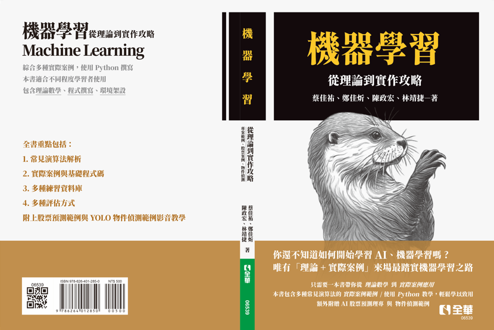

# **從理論到實作的機器學習攻略**
# **Machine Learning V3**  

  

## 本書範例使用方法
本書附有多項機器學習演算法實際案例與基礎範例，執行程式碼都放在.ipynb檔案內。  
建議使用google colab直接匯入本.ipynb檔案進行練習。  
若是要使用本機環境練習開發，可參考本書後面開發環境章節。

## 詳細資料
出版社：全華圖書  
出版日期：2025/04/18    
語言：繁體中文    
定價：500元    
ISBN：9786264012850    
叢書系列：大專電子    
規格：平裝 / 320頁 / 19 x 26 x 1.6 cm / 普通級 / 單色印刷 / 初版    
出版地：台灣    
本書分類：專業/教科書/政府出版品> 電機資訊類> 電子

## 目錄        
第一章 機器學習新手上路       
1-1 什麼是機器學習            
1-2 機器學習的種類            
1-3 免費練習開發平台          
1-4 機器學習步驟        

第二章 監督式學習       
2-1 線性回歸 Linear Regression            
2-2 支援向量機 Support Vector Machine           
2-3 單純貝氏分類器 Naïve Bayes Classifier       
2-4 決策樹Decision Tree       
2-5 隨機森林 Random Forest          
2-6 神經網路 Neural Network         
2-7 近鄰演算法 K-Nearest Neighbors        

第三章 非監督式學習           
3-1 主成分分析 Principal Components Analysis          
3-2 非負矩陣 Non-negative Matrix Factorization        
3-3 平均分群演算法 K-means          
3-4 高斯混合分布 Gaussian Mixture Models        

第四章 評估方法與訓練技巧           
4-1 分類問題評估        
4-2 回歸問題評估        
4-3 交叉驗證 Cross-Validation       
4-4 批次量 Batch Size         

第五章 最終挑戰—實戰應用            
5-1 AI 股票理財專家           
5-2 YOLOv9 物件辨識           

結語        
附錄        
附錄一 專有名詞解釋           
附錄二 環境安裝         
附錄三 參考文獻         
習題    